# _Chirp!_ Project Report

**ITU BDSA 2025 – Group 10**

**Authors**  
Andreas Bank Hyldal `<ahyl@itu.dk>`  
Cornelius Baasch Andersen `<coan@itu.dk>`  
Jacob Folkmann Præstegaard `<jafo@itu.dk>`  
Jacob Hørberg `<jacho@itu.dk>`  
Jogvan Andreas á Lad Jacobsen `<jogv@itu.dk>`

---

# Table of Contents

<!-- START doctoc generated TOC please keep comment here to allow auto update -->
<!-- DON'T EDIT THIS SECTION, INSTEAD RE-RUN doctoc TO UPDATE -->

- [Introduction](#introduction)
- [1. Design and Architecture](#1-design-and-architecture)
  - [1.1 Domain Model](#11-domain-model)
  - [1.2 Architecture — In the Small](#12-architecture--in-the-small)
  - [1.3 Architecture of the Deployed Application](#13-architecture-of-the-deployed-application)
  - [1.4 User Activities](#14-user-activities)
    - [1.4.1 Activity diagram for unauthorized user](#141-activity-diagram-for-unauthorized-user)
    - [1.4.2 Activity diagram for authorized users](#142-activity-diagram-for-authorized-users)
  - [1.5 Sequence of Functionality / Calls Through Chirp!](#15-sequence-of-functionality--calls-through-chirp)
    - [1.5.1 UML Sequence Diagram](#151-uml-sequence-diagram)
    - [1.5.2 UML Register Sequence Diagram](#152-uml-register-sequence-diagram)
    - [1.5.3 UML Post Cheep Sequence Diagram](#153-uml-post-cheep-sequence-diagram)
- [2. Process](#2-process)
  - [2.1 Build, Test, Release, and Deployment](#21-build-test-release-and-deployment)
    - [2.1.1 GitHub Actions — Activity Diagram](#211-github-actions--activity-diagram)
    - [2.1.2 Releases](#212-releases)
  - [2.2 Team Work](#22-team-work)
    - [2.2.1 Project Board Snapshot (Before Submission)](#221-project-board-snapshot-before-submission)
    - [2.2.2 Team workflow](#222-team-workflow)
    - [2.2.3 Development](#223-development)
  - [2.3 How to Make Chirp! Work Locally](#23-how-to-make-chirp-work-locally)
  - [2.4 How to Run the Test Suite Locally](#24-how-to-run-the-test-suite-locally)
    - [2.4.1 Execution Steps](#241-execution-steps)
    - [2.4.2 Types of Tests & Purpose](#242-types-of-tests--purpose)
      - [Unit Tests](#unit-tests)
      - [Integration Tests](#integration-tests)
      - [End-to-End (E2E) Tests](#end-to-end-e2e-tests)
      - [Key Testing Principles](#key-testing-principles)
- [3. Ethics](#3-ethics)
  - [3.1 License](#31-license)
  - [3.2 LLMs, ChatGPT, Copilot & AI Tools Used](#32-llms-chatgpt-copilot--ai-tools-used)

<!-- END doctoc generated TOC please keep comment here to allow auto update -->

---

# Introduction

This report documents the design, implementation, and development process of **Chirp!**, a social media web application developed as part of the Analysis, Design and Software Architecture course at IT University of Copenhagen (ITU BDSA 2025).

It's a Twitter like application, that demonstrates modern software practices, that has been taught in the course. Such as clean architecture principles, automated testing, and continuous integration and deployment. It's built using ASP.NET Core with Razor Pages for the user interface, Entity Framework Core for data persistence, and deployed on Microsoft Azure Web App Service. Authentication is implemented using ASP.NET Cores Identity API along with GitHub OAuth, in the registration of users.

This report is structured into three main sections: **Design and Architecture** presents the model, architectural decisions, and system interactions through UML diagrams. **Process** describes our development workflow, pipeline, and testing strategy; and **Ethics** addresses licensing, the use of LLM´s and AI tools during development

# 1. Design and Architecture

## 1.1 Domain Model

<figure>
    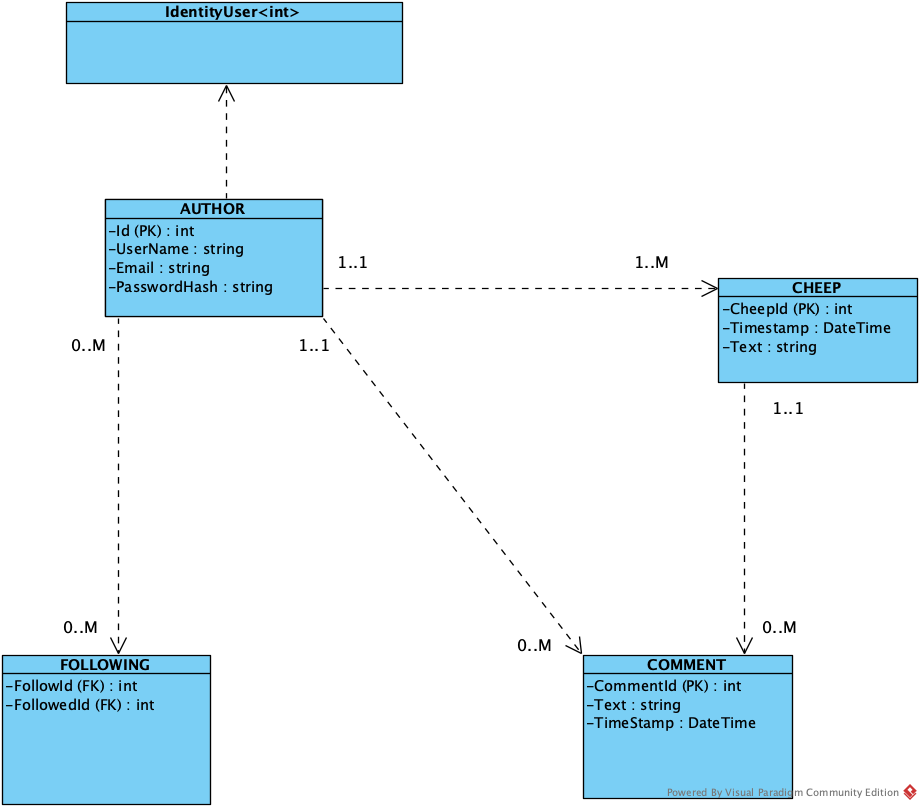
    <figcaption>Diagram 1.1: Domain Model.</figcaption>
  </figure>

The domain model includes the entities IdentityUser, Author, Cheep, Comment, and Following. Authors represent users of the system and can create multiple Cheeps, each of which belongs to exactly one Author.

Authors can write Comments on Cheeps. Each Comment is associated with one Author and one Cheep, while a Cheep can have multiple Comments.

Social relationships between Authors are handled through the Following entity, which models the many-to-many relationship of users following each other. The structure supports posting, commenting, and user connections within the system.

---

## 1.2 Architecture — In the Small

<figure>
    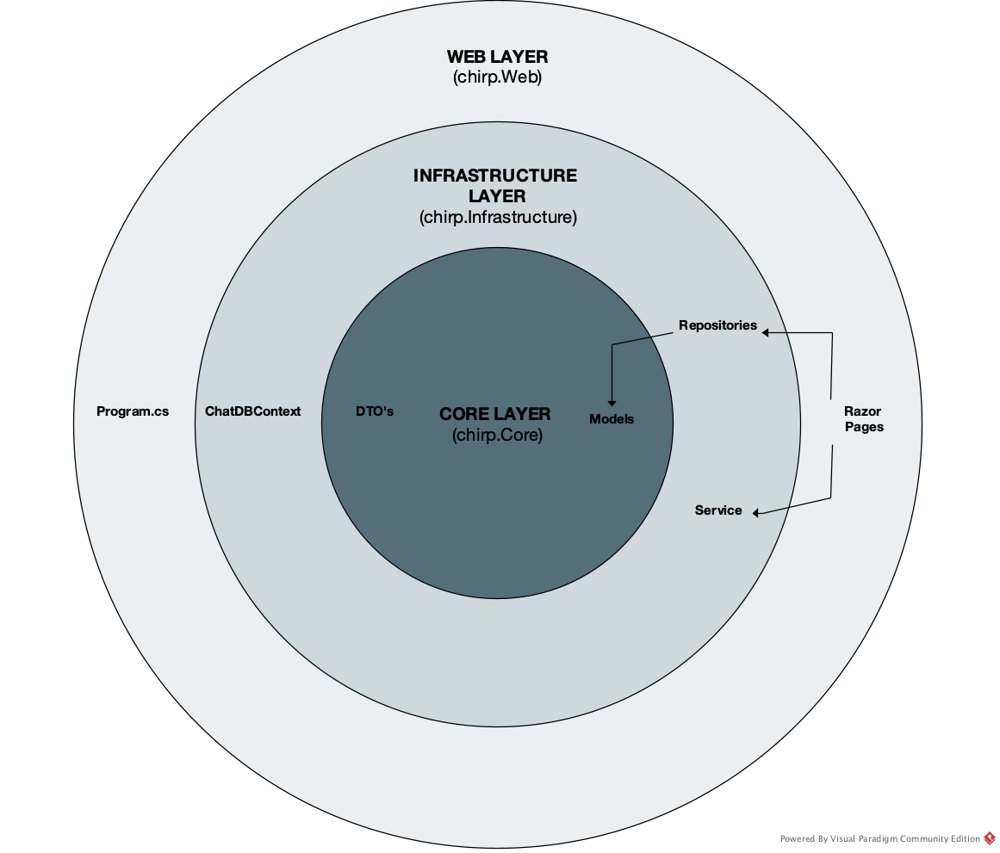
    <figcaption>Diagram 1.2: Onion architecture
  pattern.</figcaption>
  </figure>

The diagram represents dependencies between layers following the onion architecture principle. For clarity, this is a simplified view focusing on the core architectural structure. Test components are not shown in the diagram, but are distributed across the layers. At the center is the Core Layer (Chirp.Core), containing the domain entities (DTOs and Models) with zero external dependencies. The middle Infrastructure Layer (Chirp.Infrastructure) contains Repositories, Services, and the ChatDBContext for data access and persistence. The outer Web Layer (Chirp.Web) contains Program.cs for application startup and Razor Pages for the user interface.

This architecture follows SOLID design principles through consistent interface-based design and dependency injection. The onion Architecture ensures separation of concerns across layers and forces dependency injections configured in **Program.cs**.

## 1.3 Architecture of the Deployed Application

<figure>
    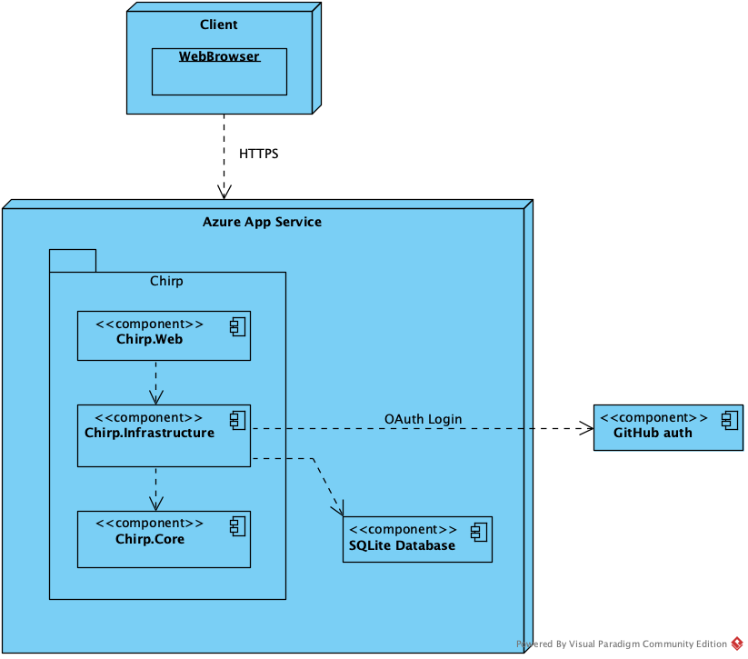
    <figcaption>Diagram 1.3: Architecture of the deployed
  application, showing the components and their interactions in the production
  environment.</figcaption>
  </figure>

The Chirp! application is deployed as a client-server web application on Microsoft Azure Web App Service. The server consists of three layers: Chirp.Web, which handles the user interface and HTTP requests, Chirp.Core, which contains the domain models and logic, and Chirp.Infrastructure, which manages data persistence using repositories and Entity Framework Core.

Users access the application through a web browser over HTTPS. Application data is stored in an SQLite database accessed by the infrastructure layer. Authentication is handled via ASP.NET CORE´s Identity API with third-party authentication with GitHub OAuth, where Chirp.Web communicates with GitHub's Authentication API when users log in.

---

## 1.4 User Activities

Unauthorized users start their user journey on the public timeline where they have the possibility to register or login to become an authorized user. Unauthorized users can view all cheeps and comments on the public timeline and they can switch between pages by clicking next/previous. They can also view a specific user's timeline by clicking the authors username.
Users can be authorized either by filling out the register form or by logging in and authorizing through GitHub. This allows users to post and comment cheeps. A user can also follow and unfollow other users and access a _"following timeline"_, containing cheeps from the users that they follow. They can also access _"my timeline"_ containing their own cheeps. Authorized users also have an _"about me"_ page, where they can view the personal information that is stored about them, such as username, email, the followed users and the cheeps they have posted. In the _"about me"_ page, the user also has the option to delete their account and all the stored information about themselves, using the _"forget me!"_ button upon confirming with their password. Users are also able to download the personal data that is stored about them by clicking _"Download my data"_. This downloads a zip file containing 3 .csv files - one with all of their cheeps, one with the users they are following and one with their username and email address (cheeps.csv, following.csv and personal_info.csv).

Below are the two activity diagrams for unauthorized and authorized users. The internal pages are illustrated as orange boxes, actions as green boxes and external pages as blue boxes. To improve readability of the diagrams, we omit arrows representing navigation back to previously visited pages. In the application, users can freely navigate between all pages at any time by clicking the page they want to use.

#### 1.4.1 Activity diagram for unauthorized user

<figure>
    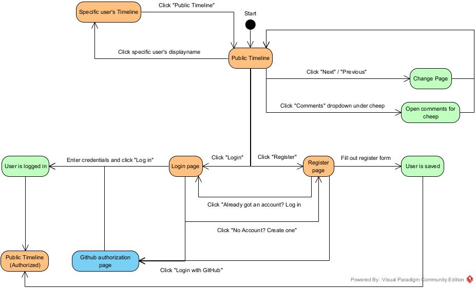
    <figcaption>Diagram 1.4.1: User journey for unauthorized
  users, showing the flow and interactions when accessing the application without
  authentication.</figcaption>
  </figure>

#### 1.4.2 Activity diagram for authorized users

<figure>
    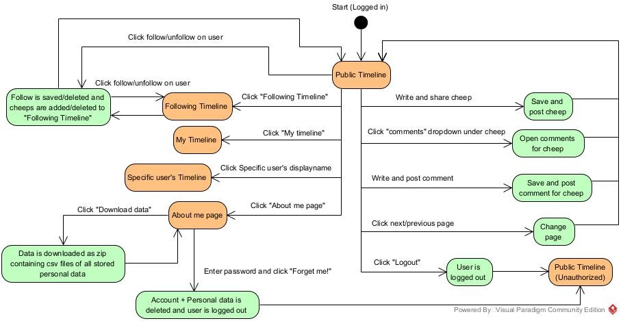
    <figcaption>Diagram 1.4.2: User journey for authorized
  users, showing the flow and interactions when accessing the application with
  authentication.</figcaption>
  </figure>

---

## 1.5 Sequence of Functionality / Calls Through Chirp!

#### 1.5.1 UML Public Timeline Sequence Diagram

<figure>
        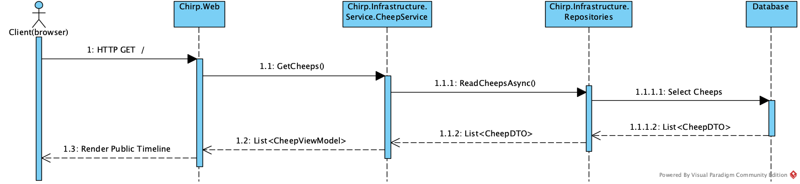
    <figcaption>Diagram 1.5.1: Sequence of calls between components, showing the order and flow of interactions within the system.</figcaption>
  </figure>

The sequence diagram shows the flow of calls when an unauthorized user requests the public timeline in the Chirp! application by sending an HTTP GET request to the root endpoint.

The request is received by the Chirp.Web layer, which routes it to the `PublicModel.OnGet(pageIndex method)` of the Razor Page. Since the user is not authenticated, the request is handled as a public request.

The page model calls `CheepService.GetCheeps(currentUser = null)` in the Chirp.Infrastructure.Service layer. This service acts as an intermediary between the web layer and the data access layer, encapsulating the logic related to retrieving cheeps.

CheepService delegates the data retrieval to the Chirp.Infrastructure.Repositories layer by calling ReadCheepsAsync(). The repository queries the database using Entity Framework Core, executing a select operation to retrieve the relevant public cheeps. The database returns the data as a list of CheepDTO objects.

The list of CheepDTOs is returned to the service layer, where it is processed and mapped into a list of CheepViewModel objects. This list is then passed back to the Chirp.Web layer.

Finally the public.cshtml Razor view is rendered using the retrieved view models, and the fully rendered HTML page is returned to the client.

Overall the diagram shows the complete request flow from the initial HTTP request through the web layer, service layer, repository layer and database, and then back to the client as a rendered web page.

#### 1.5.2 UML Register Sequence Diagram

<figure>
    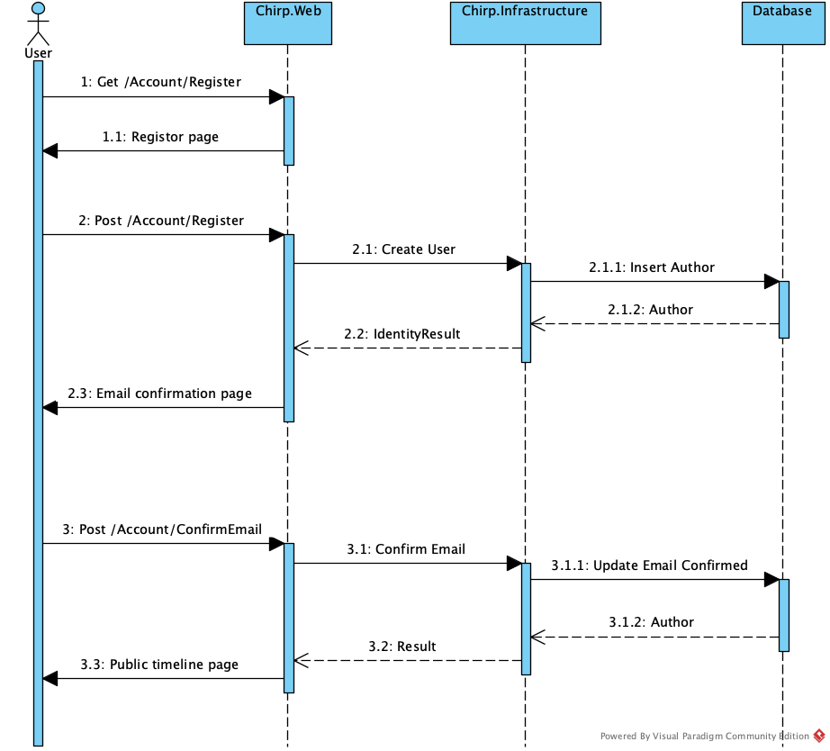
    <figcaption>Diagram 1.5.2: Sequence flow for Register  sequence</figcaption>
  </figure>

The sequence diagram illustrates the flow of calls when a user registers a new account.

The process begins when the user sends an HTTP GET request to /Account/Register. The request is received by the Chirp.Web layer, which responds by rendering and returning the registration page to the user.

The user then submits the registration form via an HTTP POST request to /Account/Register. The web layer then forwards the request to the Chirp.Infrastructure layer, which creates a new user and inserts the corresponding author into the database.

Finally the user is redirected to the public timeline page. The diagram illustrates the full registration flow across the web, infrastructure and database layers.

#### 1.5.3 UML Post Cheep Sequence Diagram

<figure>
    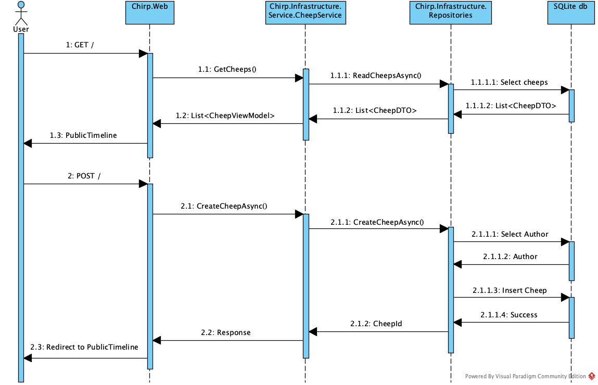
    <figcaption>Diagram 1.5.3: Sequence of posting a cheep</figcaption>
  </figure>

User can post cheeps by sending an HTTP POST request. The request is routed to the Chirp.Web, which verifies that the user is authenticated. Next, the service layer is called to actually create the cheep. The CheepService creates a DTO and calls the CheepRepository, where it is processed and saved. Next, the author is identified - if the author is already in the database, the cheep is linked to them, otherwise an author is created and inserted in the database, so the cheep can be linked. Once the cheep has been successfully inserted and saved in the database, the user will be redirected back in the chain to PublicTimeline, where the cheep is now visible.

---

# 2. Process

## 2.1 Build, Test, Release, and Deployment

#### 2.1.1 GitHub Actions — Activity Diagram

<figure>
    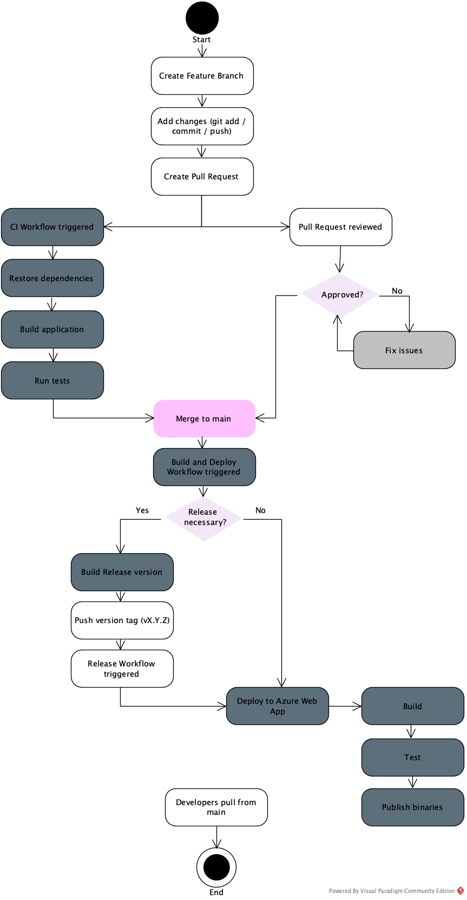
    <figcaption>Diagram 2.1.1: GitHub actions workflow diagram. </figcaption>
  </figure>

The diagram illustrates our GitHub Actions workflow used to build, test, release and deploy the Chirp! application.
Development starts by creating a feature branch, committing changes and opening a pull request. When the pull request is created, a CI workflow is triggered that restores dependencies, builds the application and runs automated tests, while the pull request is reviewed in parallel. If the CI checks succeed and the pull request is approved, the changes are merged into the main branch, which triggers the build and deployment workflow that deploys the application to Azure Web App. If a release is required, a version tag is pushed, triggering a release workflow that builds, tests and publishes platform-specific binaries.
Finally developers pull the updated main branch.

#### 2.1.2 Releases

The releases are titled with tags. The tags are following the semantic versioning structure "vX.Y.Z". X is meant for major changes to the program and means that newer tags with a higher X wont be backwards-compatible with previous releases tagged with a smaller X. Y is meant for new features, pages etc. which expand the functionality of the program. Z is meant for small improvements, bug fixes and test fixes which make the program more stable.
While release tags follow the semantic versioning structure, releases were not created for every pull-request during development. In retrospect, we would have preferred to have a release for every merge into main. This would help documenting the incremental progress and development of new features.

---

## 2.2 Team Work

#### 2.2.1 Project Board Snapshot (Before Submission)

<figure>
    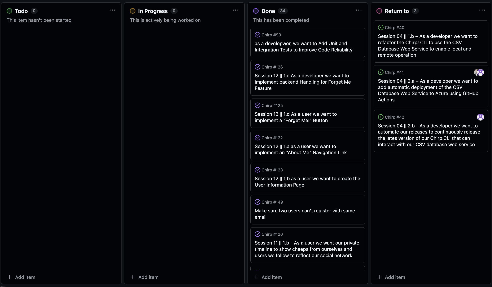
    <figcaption>Diagram 2.2.1: Final project board, showing
  the organization and status of tasks and work items at project
  completion.</figcaption>
  </figure>

The project board was used throughout the project to track tasks using a simple workflow consisting of "Todo", "In progress", "Done" and "Return to". This structure gave us a clear overview of the project's status and helped us coordinate work effectively within the team.

Each issue on the board represented a concrete feature, refactoring task or improvement. The project board played an important role in distributing assignments among team members and coordinating code additions to the project. It also supported our pair programming approach, as it made priorities visible and allowed us to track progress and responsibility continuously.

Before submission, three issues remained unimplemented. This was a conscious decision rather than an oversight. During the project period, we were behind on the weekly additions and lectures, and continuing with all planned issues would have caused us to fall further behind the course progression. Based on a recommendation from our teaching assistant, we therefore chose to skip these issues and instead focus on on refactoring and aligning the project with concepts from the more recent weeks. This decision allowed us to consolidate our understanding of newer material while still delivering a stable and maintainable project.

#### 2.2.2 Team workflow

In our project, we focused on close collaboration by working in pair and reviewing each other’s code before merges. Pair programming enabled knowledge sharing and discussion of key implementation decisions, leading to more thoughtful solutions and better design choices. This approach was ideal to our group dynamic where we have prioritized showing up physically enabling to easily understand and contribute to decisions.
We had the intention of consistently using GitHubs `Co-authored-by` for commits produced using pair programming. However, this was not done consistently throughout the project, despite the majority of the work being carried out collaboratively. Following the project descriptions on the GitHub course, commits were authored using our personal GitHub emails, while co-authors were registrered using ITU email addresses. This mismatch prevents GitHub from associating co-authored commits under the contribution insights. As a result, individual commits do not always reflect all contributors involved in the implementation.
Code reviews helped ensure consistent quality and improve readability. Many reviews were resolved through in-person discussions, which increased our shared understanding of the codebase. Overall, this approach strengthened team communication and contributed to more reliable and maintainable software.

#### 2.2.3 Development

We developed the Chirp! application using trunk-based development, where everyone worked on short-lived branches created from the main branch. The idea was to make small and frequent changes instead of large ones. This helped us avoid big merge conflicts and made it easier to see if something broke. We also got feedback faster when something didn’t work. Overall, it made the development process more simple and manageable.
Below is an illustration of the intended flow of activities.

<figure>
    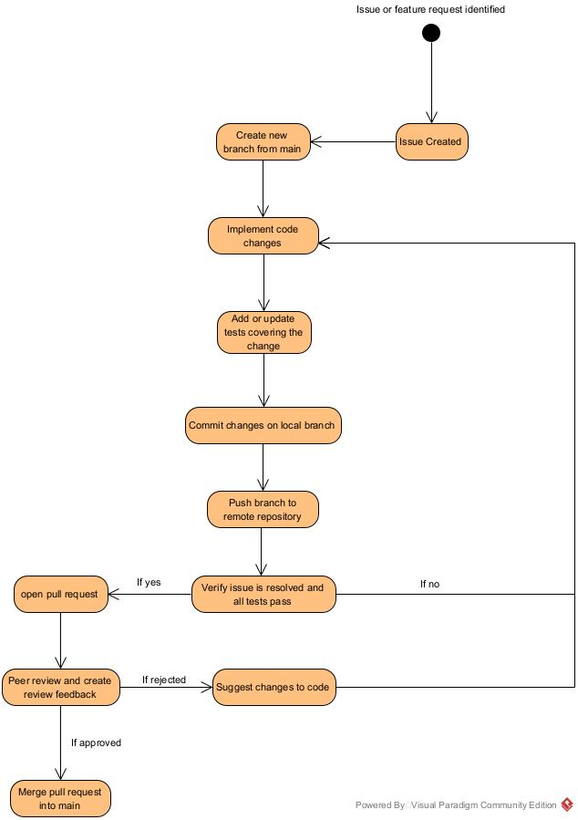
    <figcaption>Diagram 2.2.3: Flow of
  development activities, showing the
  process and stages of software
  development throughout the project
  lifecycle.</figcaption>
  </figure>

---

## 2.3 How to Make Chirp! Work Locally

In order to make the program work locally on your machine you first need to ensure you have the .NET 8.0 SDK installed on your machine.

Then clone the git repository to your machine using:

```
git clone https://github.com/ITU-BDSA2025-GROUP10/Chirp.git
```

Now run the following command from the root of the project to run the program:

```
dotnet run --project src/Chirp.Web
```

This command will in the .NET 8.0 SDK first restore the dependencies, then build and lastly run the chirp application.

You will get a output similar to:

```
info: Microsoft.Hosting.Lifetime[14]
      Now listening on: http://localhost:5273
info: Microsoft.Hosting. Lifetime[0]
      Application started. Press Ctrl+C to shut down.
```

You'll click the http://localhost:5273, which opens the application in your designated browser. From here you can see the public timeline and get access to further features by registering a new account or using GitHub.

---

## 2.4 How to Run the Test Suite Locally

#### 2.4.1 Execution Steps

The project contains three different test suites: Unit Tests, Integration Tests and End-to-End (E2E) Tests. All tests are located in the `tests` folder of the solution and can be run locally on a developer machine. Follow this complete guide to run the tests:
First ensure that your terminal is located at the root of the project before running any of the following commands.

1. Build and run the project, this is necessary to run End-to-End tests.

```
dotnet build
dotnet run --project src/Chirp.Web
```

2. Install Playwright for End-to-End tests

```
npx playwright install
```

3. Open a new terminal from project root and paste this to run all the tests

```
dotnet test
```

4. To run each tests suite individually, cd into the individual test folders and run dotnet test from there

**Integration tests:**

```
cd tests/IntegrationTests
dotnet test
```

**Unit tests:**

```
cd tests/unitTests
dotnet test
```

**End-to-End tests:**
_Remember to follow step 1. and 2. before running End-to-End tests_

```
cd tests/end2endTests
dotnet test
```

### 2.4.2 Types of Tests & Purpose

The Chirp! application uses a testing strategy consisting of unit tests, integration tests, and end-to-end (E2E) tests. This approach ensures that individual components work correctly, that components integrate properly within the application, and that the complete user workflows functions as expected.

#### Unit Tests

Unit tests validate repository logic in isolation using xUnit and FluentAssertions with an in-memory SQLite database. Each test runs against a fresh database instance, ensuring full isolation and realistic behavior without relying on mocks. The tests cover core data operations, validation, ordering, and error handling.

#### Integration Tests

Integration tests verify the behavior of the full ASP.NET Core application, including routing, and database interactions. Using xUnit, a custom WebApplicationFactory, and an in-memory SQLite database, these tests make HTTP requests to application endpoints and assert correct responses and rendered content.

#### End-to-End (E2E) Tests

E2E tests validate complete user workflows through browser automation using xUnit and Microsoft Playwright. Running in a headless Chromium browser, they simulate real user interactions such as login, navigation, and creating cheeps, making sure the application behaves correctly from a user’s perspective.

#### Key Testing Principles

All tests ensure isolation, realism, and clarity. The In-memory databases provide fast and repeatable execution, real providers and browsers ensure accurate behavior, and the Arrange–Act–Assert structure improves readability. Together, the three test layers provide comprehensive coverage from data access to user experience.

---

# 3. Ethics

### 3.1 License

The project is licensed under the MIT License, which permits free use, modification, and redistribution of the software, provided that the original copyright notice and license text are included.

### 3.2 LLMs, ChatGPT, Copilot & AI Tools Used

During the development of Chirp!, we used ChatGPT (OpenAI) and Claude (Anthropic) as supplementary tools for specific tasks such as implementing features, understanding framework concepts, and debugging.

We aimed to credit AI-assisted contributions through GitHub's `co-authored-by` feature. However, this practice was not applied consistently across all commits where LLM's were used. Upon realizing this at the late stage of writing the report, we chose not to rewrite Git history, as this would have introduced unnecessary risk and potential disruption.

The LLM responses provided helpful starting points and alternative approaches, particularly for exploring new ASP.NET Core patterns and generating initial code structures. However, all suggestions required review and adaptation to fit our architecture and requirements. LLM's were also primarily used for setting up test environments and ensuring wide test coverage.

Overall, LLM's modestly sped up development by reducing time spent on routine tasks and providing quick references. They were most useful for exploring implementation options and understanding code, but human judgment was essential for design decisions, code quality, and ensuring correctness.
